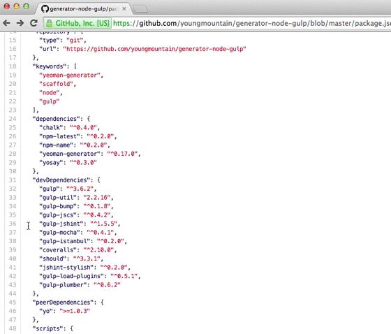

<p align="center">
  <a href="#"></a>
</p>

# GitHub Linker

[![Supported npm package][npm-image]][npm-url] [![Supported bower package][bower-image]][bower-url]

> The GitHub Linker is a Google Chrome Extension which links [npm](http://npmjs.org) and [bower](http://bower.io) dependencies listed in `package.json` and `bower.json` on GitHub to their project’s pages. It also links require() statements with the related package or file.


# Features

## package.json & bower.json
Link `dependencies` `devDependencies` `peerDependencies` and `optionalDependencies` to the related GitHub repository.

## require()
Link `require()` staments to the related GitHub repository, nodejs API page or repository file.

```js
var fs = require('fs');	// => http://nodejs.org/api/fs.html
var lodash = require('lodash'); // => https://github.com/lodash/lodash
var action = require('./lib/action'); // => https://github.com/user/repo/blob/master/lib/action.js
```

Works also with CoffeeScript:
```coffee
fs = require("fs") # => http://nodejs.org/api/fs.html
lodash = require("lodash") # => https://github.com/lodash/lodash
action = require("./lib/action") # => https://github.com/user/repo/blob/master/lib/action.coffee
```


# Preview




# Installation

Go to [Chrome Web Store](https://chrome.google.com/webstore/detail/github-linker/jlmafbaeoofdegohdhinkhilhclaklkp) and click on the add button.


# Total supported repositories

npm: 75472

bower: 11446


# Support
Should you have any problems, feel free to open up an [issue](https://github.com/stefanbuck/github-linker/issues).


# License

Copyright (c) 2014 Stefan Buck. Licensed under the MIT license.

[npm-url]: https://npmjs.org/
[npm-image]: http://img.shields.io/badge/npm-75472-green.svg
[bower-url]: https://bower.io/
[bower-image]: http://img.shields.io/badge/bower-11446-green.svg
