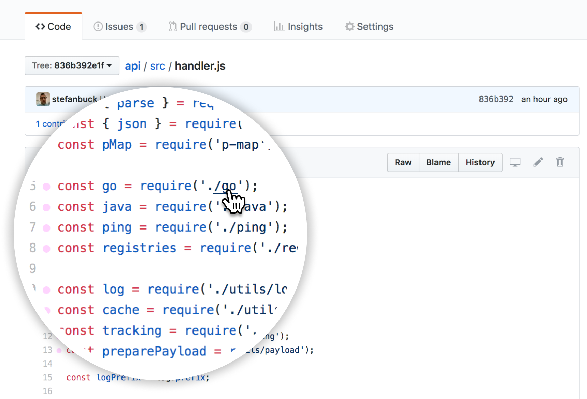

<a href="https://chrome.google.com/webstore/detail/octo-linker/jlmafbaeoofdegohdhinkhilhclaklkp"></a

## What is OctoLinker?

OctoLinker is a browser extension for GitHub, that turns language-specific statements like `include` `require` or `import` into links.

## Install

Trusted by over 30,000 developers! Install OctoLinker from [Chrome Web Store](https://chrome.google.com/webstore/detail/octo-linker/jlmafbaeoofdegohdhinkhilhclaklkp), [Mozilla Add-ons Store](https://addons.mozilla.org/en-US/firefox/addon/octolinker/), [Mac App Store](https://apps.apple.com/app/octolinker/id1549308269), [Microsoft Store](https://microsoftedge.microsoft.com/addons/detail/lbbanfffjfmfdahnfbklminikafhcjjb) and [Opera Add-ons Store](https://addons.opera.com/en/extensions/details/octolinker/).

## Special thanks to

- [Art Noir](https://www.art-noir.net/) for our amazing logo!
- Everyone who supported, [contributed](https://github.com/OctoLinker/OctoLinker/graphs/contributors), or promoted the project.

## Sponsors

 
 

I am truly grateful to all the wonderful humans and companies supporting the development of OctoLinker. Please consider donations through [GitHub Sponsors](https://github.com/sponsors/stefanbuck/) or [Open Collective](https://opencollective.com/octolinker) – Thank you 🙇‍♂️

## Privacy Policy

Our [Privacy Policy](https://octolinker.now.sh/privacy/) describes our practices related to the use, storage and disclosure of information we collect when you're using our service.

## Related

- [Awesome browser extensions for GitHub](https://github.com/stefanbuck/awesome-browser-extensions-for-github) - Awesome list
- [Refined GitHub](https://github.com/sindresorhus/refined-github/) - Tons of useful features for GitHub
- [Notifier for GitHub](https://github.com/sindresorhus/notifier-for-github-chrome) - Shows your notification unread count
- [OctoPermalinker](https://github.com/josephfrazier/octopermalinker) - Fix outdated/broken GitHub links to branches

## Disclaimer

OctoLinker is not affiliated with, sponsored by, or endorsed by GitHub Inc.

Copyright (c) 2014–present [Stefan Buck](https://stefanbuck.com/) and [other contributors](https://github.com/OctoLinker/OctoLinker/graphs/contributors).
