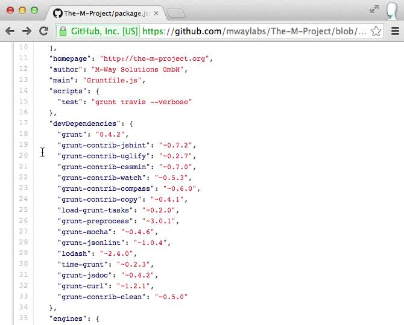

# Dependencies Linker for GitHub

The "Dependencies Linker for GitHub" is a Google Chrome Extension which links [npm](http://npmjs.org) and [bower](http://bower.io) dependencies listed in package.json / bower.json on GitHub to their project’s pages.

# Total supported repositories

NPM: 59757

bower: 10985

# Installation

Go to [Chrome Web Store](https://chrome.google.com/webstore/detail/dependencies-linker-for-g/jlmafbaeoofdegohdhinkhilhclaklkp) and click on the add button.

# Support
Should you have any problems, feel free to open up an [issue](https://github.com/stefanbuck/github-linker/issues).

